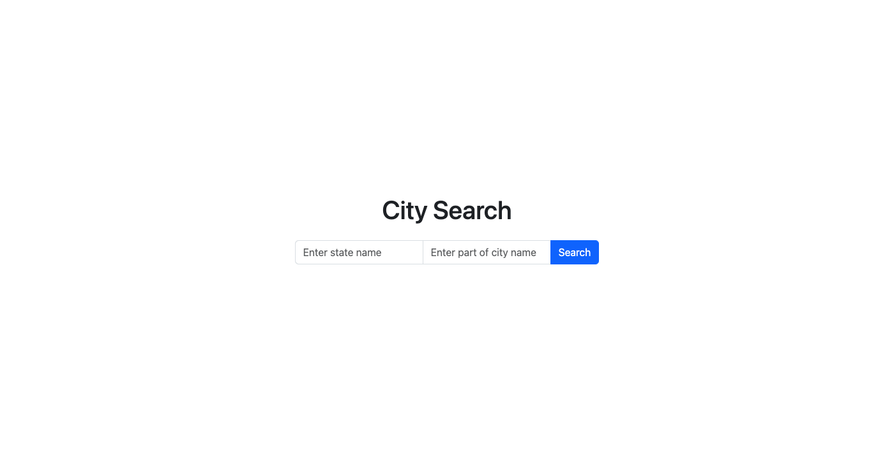
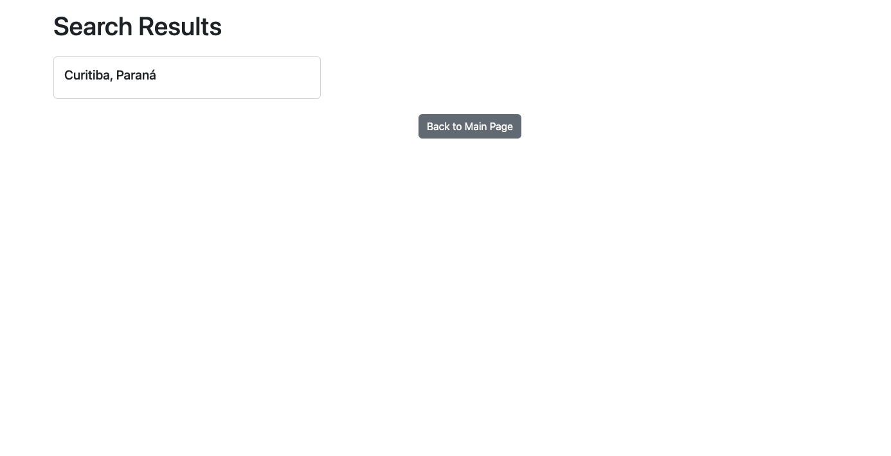

### Embarca - Teste - Backend Ruby on Rails

# Projeto City Search

Está é a pagina inicial do projeto



Está é a pagina de resultado da busca



___

# Executando o Projeto

Abra o terminal e execute o seguinte comando:

```bash
# na primeira vez que for executar o projeto:
docker-compose up web --build -d
```

Em seguida, execute o comando abaixo para criar o banco de dados

```bash
docker-compose run web rails db:setup
```

# Inserindo dados na aplicação

Caso deseje inserir os dados da seed, basta executar:

```bash
docker-compose run web rails db:seed
```

Para inserir os dados via API, basta seguir os seguintes passsos:

Para inserir um estado:
```bash
curl -X POST -H "Content-Type: application/json" -d '{
  "name": "My State",
  "abbreviation": "MS"
}' http://localhost:3000/states
```

O retorno será algo similar a isto:
```json
{"id":1,"name":"My State","abbreviation":"MS","created_at":"0000-00-00T00:00:00.000Z","updated_at":"0000-00-00T00:00:00.000Z"}
```


Agora com o `id` retornado na requisição acima, vamos criar uma cidade executando o seguinte codigo:
```bash
curl -X POST -H "Content-Type: application/json" -d '{
  "name": "My City",
  "state_id": 1
}' http://localhost:3000/cities

```
E o retorno será algo similar a isto:
```json
{"id":1,"name":"My City","state_id":1,"created_at":"0000-00-00T00:00:00.000Z","updated_at":"0000-00-00T00:00:00.000Z"}
```

# Rubocop e Testes

para executar o rubocop, abra o terminal e execute o seguinte comando:
```bash
docker-compose run rubocop
```

para executar os testes, abra o terminal e execute o seguinte comando:
```bash
docker-compose run rspec
```